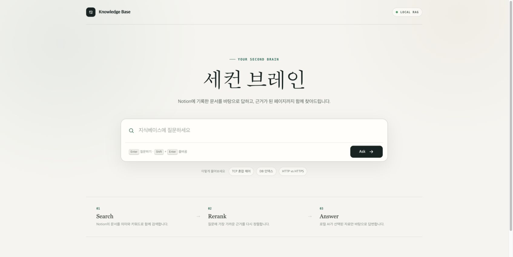
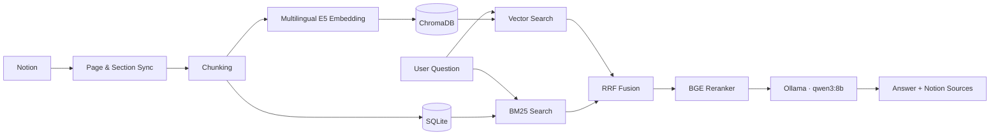

<a id="readme-top"></a>

<!-- PROJECT SHIELDS -->
<div align="center">

[![Python][python-shield]][python-url]
[![FastAPI][fastapi-shield]][fastapi-url]
[![Ollama][ollama-shield]][ollama-url]
[![Notion][notion-shield]][notion-url]

</div>

<!-- PROJECT LOGO -->
<br />
<div align="center">
  <h3 align="center">Second Brain Knowledge Base</h3>

  <p align="center">
    Notion의 지식을 검색하고, 근거가 포함된 답변을 생성하는 로컬 RAG 지식베이스
    <br />
    <br />
    <a href="http://127.0.0.1:8000"><strong>Open Local App »</strong></a>
    &middot;
    <a href="http://127.0.0.1:8000/docs">API Docs</a>
    &middot;
    <a href="https://80portisfound.github.io/blog/notion-local-rag-knowledge-base/">Blog Post</a>
  </p>
</div>

<!-- PROJECT SCREENSHOT -->
<p align="center">
  
</p>

<!-- TABLE OF CONTENTS -->
<details>
  <summary>Table of Contents</summary>
  <ol>
    <li>
      <a href="#about-the-project">About The Project</a>
      <ul>
        <li><a href="#how-it-works">How It Works</a></li>
        <li><a href="#built-with">Built With</a></li>
      </ul>
    </li>
    <li>
      <a href="#getting-started">Getting Started</a>
      <ul>
        <li><a href="#prerequisites">Prerequisites</a></li>
        <li><a href="#installation">Installation</a></li>
        <li><a href="#environment-variables">Environment Variables</a></li>
      </ul>
    </li>
    <li><a href="#usage">Usage</a></li>
    <li><a href="#api-endpoints">API Endpoints</a></li>
    <li><a href="#project-structure">Project Structure</a></li>
    <li><a href="#contributing">Contributing</a></li>
    <li><a href="#license">License</a></li>
    <li><a href="#contact">Contact</a></li>
    <li><a href="#acknowledgments">Acknowledgments</a></li>
  </ol>
</details>

<!-- ABOUT THE PROJECT -->
## About The Project

Second Brain Knowledge Base는 Notion에 흩어진 학습 자료와 문서를 하나의 검색 가능한 지식베이스로 만드는 프로젝트입니다. 질문을 입력하면 벡터 검색과 BM25 키워드 검색을 결합하고, CrossEncoder로 관련도를 다시 평가한 뒤 로컬 Ollama 모델이 선택된 근거만 사용해 답변합니다.

주요 기능:

* Notion 데이터 소스 및 하위 페이지 재귀 동기화
* 다국어 임베딩 기반 의미 검색
* BM25와 벡터 검색을 결합한 하이브리드 검색
* RRF(Reciprocal Rank Fusion) 및 CrossEncoder 재정렬
* 답변과 함께 Notion 문서 경로, 인용 내용, 원문 링크 제공
* FastAPI가 직접 제공하는 반응형 웹 UI
* SQLite와 ChromaDB를 사용한 로컬 데이터 저장

> `.env`, SQLite 데이터베이스와 ChromaDB 인덱스는 Git에서 제외됩니다. 개인 Notion 데이터와 토큰은 저장소에 포함되지 않습니다.

<p align="right">(<a href="#readme-top">back to top</a>)</p>

### How It Works



<p align="right">(<a href="#readme-top">back to top</a>)</p>

### Built With

* [FastAPI][fastapi-url] — API와 정적 프론트엔드 제공
* [SQLAlchemy][sqlalchemy-url] / SQLite — 문서 및 청크 메타데이터
* [ChromaDB][chromadb-url] — 임베딩 벡터 저장과 유사도 검색
* [Sentence Transformers][sentence-transformers-url] — 다국어 임베딩과 CrossEncoder 재정렬
* [rank-bm25][rank-bm25-url] — 키워드 기반 검색
* [Ollama][ollama-url] — `qwen3:8b` 로컬 답변 생성
* [Notion API][notion-url] — 지식 원본 동기화
* Vanilla HTML, CSS, JavaScript — 반응형 웹 인터페이스

<p align="right">(<a href="#readme-top">back to top</a>)</p>

<!-- GETTING STARTED -->
## Getting Started

### Prerequisites

* Python 3.12+
* [Ollama](https://ollama.com/download)
* Notion integration token과 연결된 data source
* 최초 실행 시 Hugging Face 모델을 내려받기 위한 인터넷 연결

Ollama 설치 후 사용할 모델을 준비합니다.

```sh
ollama pull qwen3:8b
```

### Installation

1. 저장소를 복제합니다.

   ```sh
   git clone https://github.com/80portisfound/pybo.git
   cd pybo
   ```

2. 가상환경을 만들고 활성화합니다.

   ```sh
   python -m venv .venv
   source .venv/bin/activate
   ```

3. 의존성을 설치합니다.

   ```sh
   pip install -r requirements.txt
   ```

4. 환경 변수 파일을 만듭니다.

   ```sh
   cp .env.example .env
   ```

5. `.env`에 자신의 Notion 정보와 JWT secret을 입력합니다.

6. Ollama 서버가 실행 중인지 확인한 뒤 FastAPI를 시작합니다.

   ```sh
   fastapi dev
   ```

7. 브라우저에서 [http://127.0.0.1:8000](http://127.0.0.1:8000)을 엽니다.

<p align="right">(<a href="#readme-top">back to top</a>)</p>

### Environment Variables

| Variable | Required | Description |
| --- | --- | --- |
| `NOTION_TOKEN` | Yes | Notion integration secret |
| `NOTION_DATA_SOURCE_ID` | Yes | 동기화할 Notion data source ID |
| `SECRET_KEY` | Yes | JWT 서명에 사용하는 긴 랜덤 문자열 |
| `HF_TOKEN` | No | Hugging Face 다운로드 제한 완화 및 경고 제거 |

Notion에서 integration을 만든 후 대상 데이터 소스에 해당 integration을 연결해야 API가 페이지를 읽을 수 있습니다.

<p align="right">(<a href="#readme-top">back to top</a>)</p>

<!-- USAGE EXAMPLES -->
## Usage

1. API 문서에서 `POST /notion/reindex`를 한 번 실행해 Notion 문서와 벡터 인덱스를 생성합니다.
2. 웹 화면의 입력창에 질문을 작성합니다.
3. 로컬 모델이 생성한 답변과 근거가 된 Notion 페이지를 확인합니다.

```text
질문: TCP 혼잡 제어가 뭐야?

답변: 지식베이스에서 검색한 자료를 바탕으로 생성된 설명
출처: 페이지 제목 · 페이지 경로 · 관련 문단 · Notion 링크
```

로컬 모델과 하드웨어 성능에 따라 답변 생성에는 수십 초가 걸릴 수 있습니다.

<p align="right">(<a href="#readme-top">back to top</a>)</p>

## API Endpoints

| Method | Endpoint | Description |
| --- | --- | --- |
| `GET` | `/` | 지식베이스 웹 UI |
| `GET` | `/health` | 서버 상태 확인 |
| `GET` | `/ask` | RAG 답변과 출처 생성 |
| `GET` | `/search` | 거리 필터가 적용된 벡터 검색 |
| `GET` | `/search/hybrid` | 벡터 + BM25 + reranker 검색 |
| `POST` | `/notion/sync` | 변경된 Notion 페이지 동기화 |
| `POST` | `/notion/reindex` | 전체 Notion 페이지 강제 재색인 |
| `POST` | `/vector/backfill` | 기존 청크의 벡터 인덱스 생성 |
| `GET` | `/docs` | Swagger API 문서 |

<p align="right">(<a href="#readme-top">back to top</a>)</p>

## Project Structure

```text
pybo/
├── crud/                  # SQLAlchemy CRUD 계층
├── routers/               # FastAPI API 라우터
├── schemas/               # Pydantic 요청/응답 모델
├── services/              # 검색, 임베딩, RAG, Notion 동기화
├── static/                # 지식베이스 프론트엔드
├── database.py            # SQLite 세션 설정
├── models.py              # SQLAlchemy 모델
├── notion_client.py       # Notion API 클라이언트
├── main.py                # FastAPI 애플리케이션 진입점
└── requirements.txt       # Python 의존성
```

<p align="right">(<a href="#readme-top">back to top</a>)</p>

<!-- CONTRIBUTING -->
## Contributing

개선 제안과 기여를 환영합니다.

1. Fork the Project
2. Create your Feature Branch (`git checkout -b feature/AmazingFeature`)
3. Commit your Changes (`git commit -m 'Add some AmazingFeature'`)
4. Push to the Branch (`git push origin feature/AmazingFeature`)
5. Open a Pull Request

<p align="right">(<a href="#readme-top">back to top</a>)</p>

<!-- LICENSE -->
## License

현재 별도의 오픈소스 라이선스가 지정되지 않았습니다. 사용 또는 배포 전에 저장소 소유자에게 문의해 주세요.

<p align="right">(<a href="#readme-top">back to top</a>)</p>

<!-- CONTACT -->
## Contact

GitHub: [@80portisfound](https://github.com/80portisfound)

Project Link: [https://github.com/80portisfound/pybo](https://github.com/80portisfound/pybo)

<p align="right">(<a href="#readme-top">back to top</a>)</p>

<!-- ACKNOWLEDGMENTS -->
## Acknowledgments

* [Best-README-Template](https://github.com/othneildrew/Best-README-Template)
* [FastAPI Documentation](https://fastapi.tiangolo.com/)
* [Sentence Transformers](https://www.sbert.net/)
* [Ollama](https://ollama.com/)
* [Notion API Documentation](https://developers.notion.com/)
* [Shields.io](https://shields.io/)

<p align="right">(<a href="#readme-top">back to top</a>)</p>

<!-- MARKDOWN LINKS & IMAGES -->
[python-shield]: https://img.shields.io/badge/Python-3.12%2B-3776AB?style=for-the-badge&logo=python&logoColor=white
[python-url]: https://www.python.org/
[fastapi-shield]: https://img.shields.io/badge/FastAPI-009688?style=for-the-badge&logo=fastapi&logoColor=white
[fastapi-url]: https://fastapi.tiangolo.com/
[ollama-shield]: https://img.shields.io/badge/Ollama-Local_LLM-111111?style=for-the-badge
[ollama-url]: https://ollama.com/
[notion-shield]: https://img.shields.io/badge/Notion-Knowledge_Source-000000?style=for-the-badge&logo=notion&logoColor=white
[notion-url]: https://developers.notion.com/
[sqlalchemy-url]: https://www.sqlalchemy.org/
[chromadb-url]: https://www.trychroma.com/
[sentence-transformers-url]: https://www.sbert.net/
[rank-bm25-url]: https://github.com/dorianbrown/rank_bm25
